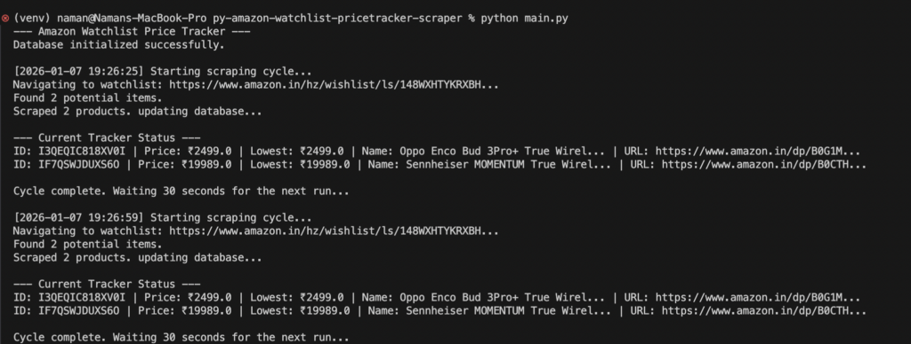
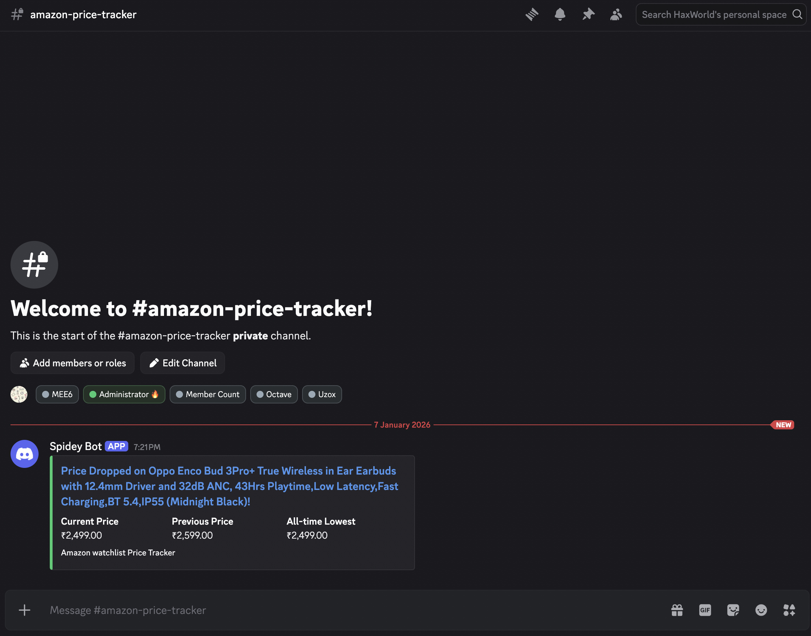

# Python Price Tracker for Amazon Watchlist

A powerful, automatic price monitoring program that uses Playwright to scrape your Amazon Watchlist, keeps pricing history in SQLite, and instantly notifies Discord of price changes.

Read the full article [here](https://blog.namankhare.com/scrape-prices-from-my-amazon-watchlist/).

## Features

The process of automatically extracting item IDs, names, prices, and URLs from your Amazon Watchlist is known as "watchlist scraping."
All information is kept in a local SQLite database called "amazon_watchlist.db."
- **All-time Low Tracking**: This feature automatically logs and alerts you when a product reaches its lowest price ever.
Rich embed alerts for price decreases, hikes, and new record lows are provided by the Discord integration.
**Automated Monitoring**: Constantly operates according to a configurable interval.

## Visuals

### 1. Visualization of databases


* Monitoring the lowest and current prices for every item on the watchlist.

### 2. Automated Execution
* Real-time terminal logs that display database updates and scraping cycles

### 3. Real-time alerts on Discord
Rich Discord embeds that rapidly alert you to price changes

## Instructions for Setup

### 1. Clone and Configure Environment 

# Construct a virtual environment
```bash
 python3 -m venv venv
 ```

# Start the virtual environment.
```bash
source venv/bin/activate
```

# Set up the dependencies
```bash 
pip install -r requirements.txt
```

### 2. Configuration 1. **Watchlist URL**: Set your `WISH_LIST_URL` by opening `config.py`.
2. Discord Webhook:
    - Transfer `.env.example` to `.env`.
    In the `DISCORD_WEBHOOK_URL` field, paste the URL of your Discord Webhook.
3. Verify the interval: Enter the frequency you want (for example, `CHECK_INTERVAL_SECONDS = 30` for the test or `3600` for an hour) in `config.py`.

## 🏃 Using the Tracker

Just execute the main script:
```bash
python main.py
```

## 📂 Project Organization

The entry point that controls the scraping and notification loop is called `main.py`.
- `scraper.py`: Logic to scrape the Amazon Watchlist using Playwright.
- `database.py`: Manages upsert logic and SQLite schema for pricing tracking.
- `notifier.py`: Uses Webhooks to provide structured messages to Discord.
Global configuration settings are found in `config.py`.
- `amazon_watchlist.db`: an automatically generated SQLite database.